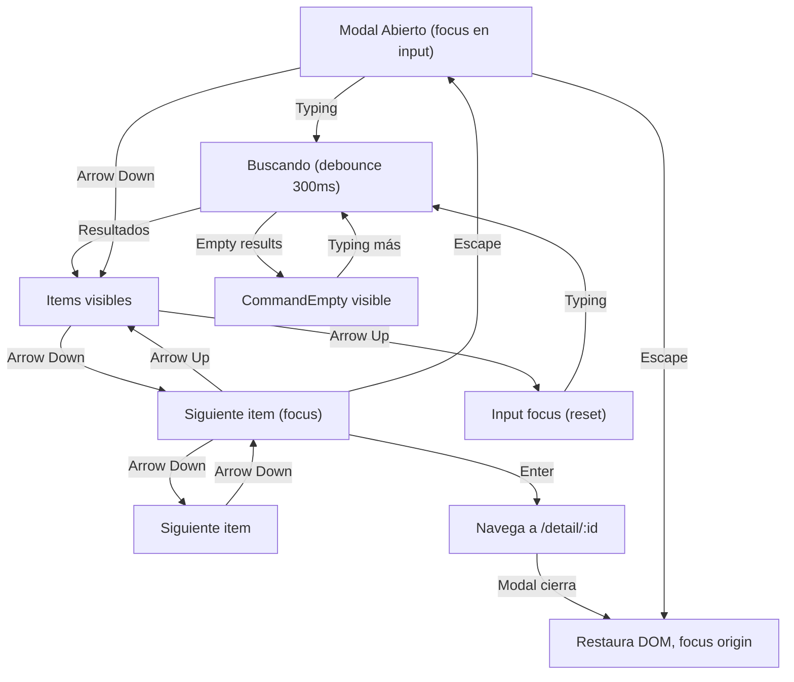

# Search Experience Design - Command + Keyboard Navigation - Verflix

**Versión**: 1.0  
**Fecha**: Febrero 2026  
**Componente**: shadcn/ui Command (Cmdk)  
**Objetivo**: Búsqueda accesible con teclado, ARIA roles, y UX intuitivo

---

## A. COMMAND COMPONENT - ESTRUCTURA BASE

### shadcn/ui Command Tree

```jsx
// Estructura jerárquica base de Command
<Command>
  ├─ CommandInput
  │  └─ (auto-focus, placeholder, onChange → debounce)
  │
  ├─ CommandList
  │  ├─ CommandEmpty (sin resultados)
  │  ├─ CommandGroup (opcional)
  │  │  └─ CommandItem × N (cada resultado)
  │  │     ├─ Movie Icon
  │  │     ├─ Content
  │  │     │  ├─ Title
  │  │     │  └─ Metadata (year + rating)
  │  │     └─ Hover/Focus state
  │  │
  │  └─ CommandSeparator (entre grupos)
  │
  └─ CommandShortcut (ESC indicador)
```

### Composición Típica - Ejemplo

```jsx
<Command className="rounded-lg border border-border bg-surface-primary">
  <CommandInput 
    placeholder="Search movies, shows, actors..."
    aria-label="Search input"
  />
  
  <CommandList>
    <CommandEmpty>
      <div className="py-6 text-center text-text-secondary">
        No results found for "{query}"
      </div>
    </CommandEmpty>
    
    <CommandGroup heading="Movies" className="overflow-hidden p-1.5">
      {results.map(movie => (
        <CommandItem key={movie.id} value={movie.id}>
          <MovieIcon className="mr-2 h-4 w-4" />
          <div className="flex-1">
            <span className="text-text-primary">{movie.title}</span>
            <span className="text-text-secondary text-xs ml-2">
              {movie.release_year}
            </span>
          </div>
          <Badge variant="outline" className="ml-2">
            {movie.vote_average}⭐
          </Badge>
        </CommandItem>
      ))}
    </CommandGroup>
  </CommandList>
</Command>
```

---

## B. KEYBOARD SHORTCUTS - ATAJO DE TECLADO

### Primary Shortcut: Cmd+K (Mac) / Ctrl+K (Windows/Linux)

```
┌─────────────────────────────────────────────┐
│ KEYBOARD SHORTCUT PATTERN                   │
├─────────────────────────────────────────────┤
│                                             │
│ Trigger: Cmd+K (Mac) o Ctrl+K (Windows)   │
│ ├─ Detectar con useEffect + keydown event  │
│ ├─ Verificar: event.metaKey (Mac)          │
│ ├─ Verificar: event.ctrlKey (Windows)      │
│ ├─ Verificar: event.key === 'k'            │
│ └─ preventDefault() para no escribir 'k'    │
│                                             │
│ Action: Abrir command modal                │
│ ├─ Fade-in backdrop + modal (300ms)        │
│ ├─ Auto-focus en CommandInput               │
│ ├─ Clear input previo (opcional)           │
│ └─ Estado: Modal visible (z-50)            │
│                                             │
│ Visual Feedback:                            │
│ ├─ Navbar mostraría "⌘K" o "⌃K" badge    │
│ ├─ Tooltip: "Press Cmd+K to search"        │
│ └─ En mobile: Input visible en navbar      │
│                                             │
└─────────────────────────────────────────────┘
```

### Implementation Hook

```jsx
function useCommandOpen(setOpen) {
  useEffect(() => {
    const down = (e) => {
      // Cmd+K (Mac) o Ctrl+K (Windows)
      if ((e.metaKey || e.ctrlKey) && e.key === 'k') {
        e.preventDefault();
        setOpen(prev => !prev);
      }
      
      // ESC para cerrar
      if (e.key === 'Escape') {
        setOpen(false);
      }
    };
    
    document.addEventListener('keydown', down);
    return () => document.removeEventListener('keydown', down);
  }, []);
}

// Uso
function SearchCommand() {
  const [open, setOpen] = useState(false);
  useCommandOpen(setOpen);
  
  return (
    <Dialog open={open} onOpenChange={setOpen}>
      <DialogContent>
        {/* Command component aquí */}
      </DialogContent>
    </Dialog>
  );
}
```

### Visual Indicator (Navbar Badge)

```
┌──────────────────────────────────────────────┐
│ NAVBAR - Search Bar with Shortcut Badge      │
├──────────────────────────────────────────────┤
│                                              │
│ Input + Badge (ejemplo):                     │
│ ┌─────────────────────────────────────┐     │
│ │ 🔍 Search movies... │ ⌘K │         │     │
│ └─────────────────────────────────────┘     │
│     ^                     ^                  │
│     |                     |                  │
│ Placeholder      Shortcut indicator (gris)  │
│                                              │
│ Tailwind Classes:                            │
│ <div className="flex items-center gap-2">   │
│   <Input placeholder="Search..." />          │
│   <kbd className="text-xs text-text-tertiary
│      bg-surface-secondary px-2 py-1         │
│      rounded border border-border">         │
│     ⌘K                                       │
│   </kbd>                                     │
│ </div>                                       │
│                                              │
└──────────────────────────────────────────────┘
```

---

## C. COMMAND INPUT - BÚSQUEDA ESTADO

### CommandInput Component Spec

```
┌──────────────────────────────────────────────┐
│ COMMAND INPUT STATE MACHINE                  │
├──────────────────────────────────────────────┤
│                                              │
│ 1. IDLE (búsqueda no iniciada)              │
│    ├─ Input vacío ("")                      │
│    ├─ Placeholder visible: "Search..."      │
│    ├─ Cursor parpadeante                    │
│    ├─ No hay resultados mostrados           │
│    └─ Border: border-border (color normal)  │
│                                              │
│ 2. TYPING (usuario escribiendo)             │
│    ├─ Input activo (focus visible)          │
│    ├─ Debounce: 300ms antes de fetch       │
│    ├─ Loading indicator (opcional): spinner  │
│    ├─ Border: border-accent-blue (focus)   │
│    └─ Can clear button: "×" (si hay texto) │
│                                              │
│ 3. SEARCHING (fetch en progreso)           │
│    ├─ Input deshabilitado (opcional)        │
│    ├─ Spinner al lado del input            │
│    ├─ Resultados previos aún visibles      │
│    └─ Mensaje: "Searching..."               │
│                                              │
│ 4. RESULTS_FOUND (resultados disponibles)  │
│    ├─ Input activo                          │
│    ├─ Spinner desaparece                    │
│    ├─ Resultados muestran (fade-in)        │
│    ├─ Count: "6 results found"             │
│    └─ Border: border-accent-green (éxito)  │
│                                              │
│ 5. NO_RESULTS (búsqueda sin coincidencias)  │
│    ├─ Input activo                          │
│    ├─ CommandEmpty visible                  │
│    ├─ Icon: 🔍 (search) o 🚫 (no found)  │
│    ├─ Message: "No results for '{query}'"  │
│    └─ Border: border-border (neutral)       │
│                                              │
│ 6. ERROR (fetch falló)                      │
│    ├─ Input activo                          │
│    ├─ Error message visible                 │
│    ├─ Icon: ⚠️ (warning)                   │
│    ├─ Message: "Error loading results"      │
│    ├─ Button: "Retry"                       │
│    └─ Border: border-danger (rojo)          │
│                                              │
└──────────────────────────────────────────────┘
```

### Debounce Strategy

```jsx
function useSearchDebounce(query, delay = 300) {
  const [debouncedQuery, setDebouncedQuery] = useState(query);
  const [isSearching, setIsSearching] = useState(false);
  
  useEffect(() => {
    setIsSearching(true);
    
    const timer = setTimeout(() => {
      setDebouncedQuery(query);
      setIsSearching(false);
    }, delay);
    
    return () => clearTimeout(timer);
  }, [query, delay]);
  
  return { debouncedQuery, isSearching };
}

// Uso
const [query, setQuery] = useState('');
const { debouncedQuery, isSearching } = useSearchDebounce(query, 300);

useEffect(() => {
  if (debouncedQuery.length < 2) return; // Min 2 chars
  
  fetchSearchResults(debouncedQuery).then(setResults);
}, [debouncedQuery]);
```

---

## D. COMMAND RESULTS - FORMATO Y VISUALIZACIÓN

### Result Item Structure

```
┌────────────────────────────────────────────────┐
│ SEARCH RESULT ITEM (MovieCard inline)          │
├────────────────────────────────────────────────┤
│                                                │
│  State: IDLE (no hover/focus)                  │
│  ┌──────────────────────────────────────────┐ │
│  │ 🎬 Dune: Part Two       2024  │ 8.8⭐  │ │
│  └──────────────────────────────────────────┘ │
│    ^                       ^       ^    ^      │
│    |                       |       |    |      │
│   Icon              Year (xs text) | Rating   │
│                                  sep           │
│                                                │
│  State: FOCUS (keyboard nav) / HOVER         │
│  ┌──────────────────────────────────────────┐ │
│  │▌🎬 Dune: Part Two       2024  │ 8.8⭐  │ │
│  └──────────────────────────────────────────┘ │
│   └─ Highlight: left-2 border-accent-blue    │
│   └─ BG: bg-surface-secondary                │
│   └─ Title: Bold o más luminoso              │
│                                                │
│  Layout Flexbox:                              │
│  Container                                    │
│  ├─ Icon (h-4 w-4, mr-2, flex-shrink-0)     │
│  ├─ Content (flex-1, min-w-0)                │
│  │  ├─ Title (text-sm font-semibold)         │
│  │  └─ Year (text-xs text-text-secondary)   │
│  └─ Badge (flex-shrink-0, ml-2)              │
│     └─ Rating (text-xs font-bold)            │
│                                                │
└────────────────────────────────────────────────┘
```

### Result Item Component

```jsx
<CommandItem
  value={movie.id}
  onSelect={(currentValue) => {
    setSelectedMovie(currentValue);
    setOpen(false); // Close command on select
    navigate(`/detail/${currentValue}`);
  }}
  className="cursor-pointer"
>
  {/* Icon */}
  <Film className="mr-2 h-4 w-4 text-text-secondary flex-shrink-0" />
  
  {/* Content */}
  <div className="flex-1 min-w-0">
    <span className="text-text-primary font-semibold truncate">
      {movie.title}
    </span>
    <span className="text-text-secondary text-xs ml-2">
      {movie.release_year}
    </span>
  </div>
  
  {/* Rating Badge */}
  <Badge variant="secondary" className="ml-2 flex-shrink-0">
    {movie.vote_average.toFixed(1)}⭐
  </Badge>
</CommandItem>
```

### Result Groups (Múltiples categorías)

```
┌────────────────────────────────────────────────┐
│ SEARCH RESULTS WITH GROUPS                     │
├────────────────────────────────────────────────┤
│                                                │
│ MOVIES (showing 3)                            │
│ ─────────────────────────────────────────     │
│ 🎬 Dune: Part Two       2024  │ 8.8⭐       │
│ 🎬 Inception             2010  │ 8.8⭐       │
│ 🎬 Interstellar          2014  │ 8.6⭐       │
│                                                │
│ ─────────────────────────────────────────     │
│                                                │
│ ACTORS (showing 2)                            │
│ ─────────────────────────────────────────     │
│ 👤 Timothée Chalamet                         │
│ 👤 Zendaya                                   │
│                                                │
└────────────────────────────────────────────────┘

Nota: Comenzar buscando solo Movies
Expandir a Actors/Directors después si TMDB lo permite
```

---

## E. KEYBOARD NAVIGATION - FLUJO COMPLETO

### Navigation Keyboard Shortcuts

```
┌─────────────────────────────────────────────────┐
│ KEYBOARD SHORTCUTS - COMMAND MODAL              │
├─────────────────────────────────────────────────┤
│                                                 │
│ Cmd+K / Ctrl+K                                │
│ └─ Abre comando modal                         │
│                                                 │
│ Character input (a-z, 0-9)                   │
│ └─ Desplaza focus a input, tipea carácter   │
│                                                 │
│ Arrow Up / Arrow Down                         │
│ ├─ Navega entre items (listbox navigation)   │
│ ├─ Loop circular (última item → primera)     │
│ ├─ Scroll en CommandList si necesario        │
│ └─ Focus visual ring-2 en item               │
│                                                 │
│ Home / End                                    │
│ ├─ Jump al primer/último item                │
│ └─ Útil para listas largas                   │
│                                                 │
│ Enter                                         │
│ ├─ Selecciona item en focus                  │
│ ├─ Navega a /detail/:movieId                │
│ ├─ Cierra comando modal                      │
│ └─ Restaura focus a navbar search (opcional) │
│                                                 │
│ Escape                                        │
│ ├─ Cierra comando modal                      │
│ ├─ Restaura focus a trigger element          │
│ └─ Limpia input (opcional)                   │
│                                                 │
│ Backspace / Delete                            │
│ ├─ En input: delete carácter                 │
│ ├─ Clear button visual al lado               │
│ └─ No hace nada en items focused             │
│                                                 │
│ Tab                                           │
│ ├─ NO navega items (cmdk lo previene)        │
│ ├─ Focus trap en modal (accessibility)       │
│ └─ Escape para salir del trap               │
│                                                 │
└─────────────────────────────────────────────────┘
```

### Navigation State Machine (Mermaid)



---

## F. COMANDO MODAL - ESTRUCTURA Y LAYOUT

### Modal Container Spec

```
┌────────────────────────────────────────────────┐
│ COMMAND MODAL - FULL STRUCTURE                 │
├────────────────────────────────────────────────┤
│                                                │
│ DIALOG OVERLAY (bg-black/80, backdrop-blur)   │
│ ├─ z-50                                       │
│ ├─ opacity-0 open:opacity-100 (fade in)      │
│ └─ Backdrop click → close modal               │
│                                                │
│ DIALOG CONTENT (centered, max-w-2xl)         │
│ ├─ rounded-xl border border-border           │
│ ├─ bg-background (no padding, Command toma) │
│ ├─ shadow-md                                  │
│ ├─ scale-0 open:scale-100 (zoom in)          │
│ └─ transition-all duration-300                │
│                                                │
│ COMMAND COMPONENT                             │
│ ├─ CommandInput (px-4 py-3)                  │
│ │  ├─ Placeholder: "Search movies..."        │
│ │  ├─ Auto-focus (autofocus attribute)       │
│ │  ├─ Clear button (visible si tiene texto)  │
│ │  ├─ Loading spinner (si isSearching)       │
│ │  └─ aria-label="Search"                    │
│ │                                             │
│ └─ CommandList (max-h-96 overflow-y-auto)    │
│    ├─ CommandEmpty (py-6 text-center)       │
│    │  └─ Message + icon 🔍                   │
│    │                                          │
│    ├─ CommandGroup (p-1.5)                   │
│    │  ├─ heading="Movies"                    │
│    │  └─ CommandItem × N                     │
│    │     ├─ Hoverable (bg-surface-secondary) │
│    │     └─ Selectable (onSelect handler)    │
│    │                                          │
│    └─ CommandSeparator (my-1)               │
│                                               │
│ FOOTER (optional)                             │
│ └─ "Press ESC to close" (text-xs)            │
│    └─ Helpful hint (mobile: ocultar)         │
│                                                │
└────────────────────────────────────────────────┘
```

### Modal Tailwind Implementation

```jsx
<Dialog open={open} onOpenChange={setOpen}>
  <DialogContent className="max-w-2xl p-0 gap-0 rounded-xl border border-border">
    <Command className="[&_[cmdk-input-wrapper]_svg]:hidden">
      <CommandInput
        placeholder="Search movies, shows, actors..."
        className="px-4 py-3 text-base"
        autoFocus
        aria-label="Search movies"
      />
      
      <CommandList className="max-h-96 overflow-y-auto">
        <CommandEmpty className="py-6 text-center">
          <Search className="mx-auto h-4 w-4 text-text-tertiary mb-2" />
          <p className="text-text-secondary text-sm">
            No results found for "{query}".
          </p>
        </CommandEmpty>
        
        {isSearching && (
          <div className="py-6 text-center">
            <Loader2 className="mx-auto h-4 w-4 animate-spin text-text-secondary" />
            <p className="text-text-secondary text-sm mt-2">Searching...</p>
          </div>
        )}
        
        {!isSearching && results.length > 0 && (
          <CommandGroup heading="Movies" className="overflow-hidden p-1.5">
            {results.map(movie => (
              <CommandItem
                key={movie.id}
                value={movie.id}
                onSelect={handleSelectMovie}
                className="px-3 py-2 cursor-pointer rounded data-[selected='true']:bg-surface-secondary"
              >
                <Film className="mr-2 h-4 w-4 flex-shrink-0" />
                <span className="flex-1 truncate text-text-primary">
                  {movie.title}
                </span>
                <span className="text-text-secondary text-xs ml-2">
                  {new Date(movie.release_date).getFullYear()}
                </span>
                <Badge variant="outline" className="ml-2 flex-shrink-0">
                  {movie.vote_average.toFixed(1)}⭐
                </Badge>
              </CommandItem>
            ))}
          </CommandGroup>
        )}
      </CommandList>
    </Command>
    
    {/* Footer hint */}
    <div className="border-t border-border px-4 py-2 text-xs text-text-tertiary">
      <kbd className="kbd">Esc</kbd> to close
    </div>
  </DialogContent>
</Dialog>
```

---

## G. EMPTY & ERROR STATES

### Empty State Variations

```
┌────────────────────────────────────────────────┐
│ EMPTY STATE 1: INITIAL (no query)              │
├────────────────────────────────────────────────┤
│                                                │
│              🎬                                │
│        Start Searching                        │
│   Enter a movie title to begin                │
│                                                │
│  Aparecer: Cuando input vacío                 │
│  Icon: 🎬 (film)                             │
│  Mensaje: "Start Searching"                   │
│  Hint: "Enter a movie title..."               │
│                                                │
└────────────────────────────────────────────────┘

┌────────────────────────────────────────────────┐
│ EMPTY STATE 2: NO RESULTS                      │
├────────────────────────────────────────────────┤
│                                                │
│              🔍                                │
│        No Results Found                       │
│   We couldn't find any movies matching        │
│              "Xyz123"                         │
│                                                │
│  Aparecer: Cuando query != '' && results = []│
│  Icon: 🔍 (search)                           │
│  Mensaje: "No Results Found"                  │
│  Hint: Mostrar query en comillas              │
│  Tips: "Try different keywords or check       │
│        spelling"                              │
│                                                │
└────────────────────────────────────────────────┘

┌────────────────────────────────────────────────┐
│ EMPTY STATE 3: MINIMUM LENGTH (< 2 chars)     │
├────────────────────────────────────────────────┤
│                                                │
│              ⌨️                                │
│        Keep Typing                            │
│   Enter at least 2 characters to search       │
│                                                │
│  Aparecer: Cuando query.length < 2            │
│  Icon: ⌨️ (keyboard)                         │
│  Mensaje: "Keep Typing"                       │
│  Hint: "Minimum 2 characters"                 │
│                                                │
└────────────────────────────────────────────────┘
```

### Error State Variations

```
┌────────────────────────────────────────────────┐
│ ERROR STATE 1: NETWORK ERROR                   │
├────────────────────────────────────────────────┤
│                                                │
│              🌐                                │
│        Connection Error                       │
│   Unable to reach the server. Please try      │
│              again later.                     │
│                                                │
│            [Retry]                            │
│                                                │
│  Aparecer: Cuando fetch.catch()               │
│  Icon: 🌐 (globe) o ⚠️ (warning)            │
│  Mensaje: "Connection Error"                  │
│  Button: "Retry" (refetch con mismo query)   │
│  Timing: Toast notification simultáneamente  │
│                                                │
└────────────────────────────────────────────────┘

┌────────────────────────────────────────────────┐
│ ERROR STATE 2: API ERROR (quota/timeout)       │
├────────────────────────────────────────────────┤
│                                                │
│              ⚠️                                │
│        Search Unavailable                     │
│   The search service is temporarily           │
│         unavailable. Try again.               │
│                                                │
│            [More Info]                        │
│                                                │
│  Aparecer: Cuando API retorna 429, 503, etc  │
│  Icon: ⚠️ (warning)                          │
│  Mensaje: "Search Unavailable"                │
│  Button: "More Info" (link a status page)    │
│                                                │
└────────────────────────────────────────────────┘
```

### Error Component Implementation

```jsx
function SearchError({ error, onRetry }) {
  return (
    <div className="py-8 text-center">
      <AlertCircle className="mx-auto h-8 w-8 text-danger mb-3" />
      <h3 className="text-base font-semibold text-text-primary">
        {error.type === 'network' 
          ? 'Connection Error' 
          : 'Search Unavailable'}
      </h3>
      <p className="text-text-secondary text-sm mt-1">
        {error.message}
      </p>
      {error.type === 'network' && (
        <Button 
          variant="outline" 
          size="sm" 
          onClick={onRetry}
          className="mt-4"
        >
          <RotateCw className="h-3 w-3 mr-1" />
          Retry
        </Button>
      )}
    </div>
  );
}
```

---

## H. FOCUS MANAGEMENT & ARIA ROLES

### Focus Criteria

```
┌────────────────────────────────────────────────┐
│ FOCUS MANAGEMENT - COMMAND MODAL              │
├────────────────────────────────────────────────┤
│                                                │
│ 1. MODAL OPENS (focus trap)                   │
│    ├─ Focus auto-move a CommandInput         │
│    ├─ Input recibe :focus-visible ring-2     │
│    ├─ Ring color: ring-accent-blue            │
│    └─ Transición: instant (no delay)         │
│                                                │
│ 2. INPUT FOCUSED (typing)                     │
│    ├─ Cursor visible (blink animation)       │
│    ├─ Border: border-accent-blue              │
│    ├─ Background: bg-surface-primary         │
│    ├─ Clear button visible si has chars      │
│    └─ Outline: none (custom ring)            │
│                                                │
│ 3. ARROW KEY PRESSED (nav)                    │
│    ├─ Focus move a primera CommandItem       │
│    ├─ Item highlight: bg-surface-secondary   │
│    ├─ Item focus: ring-2 ring-offset-0       │
│    ├─ Scroll in CommandList si needed        │
│    └─ Transición: smooth (no delay)          │
│                                                │
│ 4. ITEM FOCUSED (keyboard or hover)          │
│    ├─ BG color: bg-surface-secondary          │
│    ├─ Left border: border-l-2 accent-blue    │
│    ├─ Text: text-text-primary (highlight)   │
│    ├─ Icon: color-accent-blue (opcional)    │
│    └─ Focus ring: ring-2 (visible)           │
│                                                │
│ 5. ITEM SELECTED (Enter pressed)             │
│    ├─ Pulse animation (optional)             │
│    ├─ Close modal (fade-out 300ms)           │
│    ├─ Navega a /detail/:id                   │
│    └─ Focus restore: a trigger element (nav) │
│                                                │
│ 6. MODAL CLOSES (ESC or backdrop click)      │
│    ├─ Focus restore: a trigger element       │
│    ├─ Modal fade-out 300ms                   │
│    ├─ Backdrop fade-out simultáneamente      │
│    └─ Scroll restore (y position)            │
│                                                │
└────────────────────────────────────────────────┘
```

### Focus Styling (Tailwind)

```css
/* CommandInput focus */
.command-input:focus-visible {
  @apply outline-none ring-2 ring-accent-blue ring-offset-0 border-transparent;
}

/* CommandItem focus/hover */
.command-item:hover,
.command-item[aria-selected="true"] {
  @apply bg-surface-secondary border-l-2 border-accent-blue;
}

.command-item:focus-visible {
  @apply outline-none ring-2 ring-accent-blue ring-offset-0;
}
```

### Focus Trap Implementation

```jsx
function useCommandFocusTrap(open) {
  const contentRef = useRef(null);
  
  useEffect(() => {
    if (!open) return;
    
    const handleKeyDown = (e) => {
      // ESC to close (handled by Dialog)
      if (e.key === 'Escape') return;
      
      // Prevent Tab from leaving modal (focus trap)
      if (e.key === 'Tab') {
        const focusableElements = contentRef.current?.querySelectorAll(
          'input, button, [role="option"]'
        );
        if (!focusableElements?.length) return;
        
        const firstElement = focusableElements[0];
        const lastElement = focusableElements[focusableElements.length - 1];
        
        if (e.shiftKey && document.activeElement === firstElement) {
          e.preventDefault();
          lastElement?.focus();
        } else if (!e.shiftKey && document.activeElement === lastElement) {
          e.preventDefault();
          firstElement?.focus();
        }
      }
    };
    
    document.addEventListener('keydown', handleKeyDown);
    return () => document.removeEventListener('keydown', handleKeyDown);
  }, [open]);
  
  return contentRef;
}
```

---

## I. ARIA ROLES & ACCESSIBILITY ATTRIBUTES

### Semantic ARIA Structure

```
<Dialog
  open={open}
  onOpenChange={setOpen}
  aria-label="Search movies"
  role="dialog"
  aria-modal="true"
  aria-live="polite"
>
  <DialogContent role="region" aria-label="Search results">
    
    <Command role="combobox" aria-expanded={open}>
      
      {/* INPUT */}
      <CommandInput
        aria-label="Search input for movies"
        aria-describedby="search-help"
        aria-autocomplete="list"
        aria-controls="search-listbox"
        aria-expanded={results.length > 0}
        role="combobox"
      />
      
      <span id="search-help" className="sr-only">
        Type to search for movies. Use arrow keys to navigate results.
        Press Enter to select or Escape to close.
      </span>
      
      {/* LISTBOX */}
      <CommandList
        id="search-listbox"
        role="listbox"
        aria-label="Search results"
        aria-live="polite"
        aria-labelledby="search-input"
      >
        {/* EMPTY */}
        <CommandEmpty
          role="status"
          aria-live="polite"
          aria-label="No results found"
        >
          No results
        </CommandEmpty>
        
        {/* RESULTS */}
        <CommandGroup role="group" aria-label="Movies">
          {results.map(movie => (
            <CommandItem
              key={movie.id}
              role="option"
              aria-selected={selectedId === movie.id}
              aria-label={`${movie.title}, ${movie.release_year}, rating ${movie.vote_average}`}
            >
              {/* Content */}
            </CommandItem>
          ))}
        </CommandGroup>
        
      </CommandList>
      
    </Command>
    
  </DialogContent>
</Dialog>
```

### ARIA Attributes Reference

```
┌──────────────────────────────────────────────────┐
│ ARIA ATTRIBUTES - COMMAND SEARCH MODAL          │
├──────────────────────────────────────────────────┤
│                                                  │
│ DIALOG                                           │
│ ├─ role="dialog"                                │
│ ├─ aria-modal="true"                            │
│ ├─ aria-label="Search movies"                   │
│ └─ aria-live="polite" (announce changes)       │
│                                                  │
│ COMMAND (root)                                  │
│ ├─ role="combobox"                             │
│ ├─ aria-expanded={open}                        │
│ └─ aria-owns="search-listbox"                  │
│                                                  │
│ INPUT                                           │
│ ├─ type="search" (semantic HTML)               │
│ ├─ role="combobox"                            │
│ ├─ aria-autocomplete="list"                    │
│ ├─ aria-controls="search-listbox" (owns)      │
│ ├─ aria-expanded={hasResults}                  │
│ ├─ aria-label="Search input..."                │
│ ├─ aria-describedby="search-help"             │
│ └─ aria-required="false"                       │
│                                                  │
│ LISTBOX                                         │
│ ├─ role="listbox"                             │
│ ├─ id="search-listbox" (referenced by input)  │
│ ├─ aria-label="Search results"                │
│ ├─ aria-live="polite" (announce new items)    │
│ ├─ aria-busy={isSearching}                    │
│ └─ aria-labelledby="search-label"             │
│                                                  │
│ LISTITEM (CommandItem)                         │
│ ├─ role="option"                              │
│ ├─ aria-selected={isFocused}                  │
│ ├─ aria-label="{title}, {year}, {rating}"    │
│ ├─ tabindex="-1" (controlled by listbox)      │
│ └─ data-selected={isFocused} (state indicator)│
│                                                  │
│ EMPTY STATE                                     │
│ ├─ role="status"                              │
│ ├─ aria-live="polite"                         │
│ ├─ aria-label="No results found"              │
│ └─ aria-atomic="true"                         │
│                                                  │
│ LOADING STATE (spinner)                        │
│ ├─ aria-hidden="true" (icon decorativo)       │
│ ├─ aria-live="polite"                         │
│ └─ Mensaje: "Searching..." en aria-label      │
│                                                  │
└──────────────────────────────────────────────────┘
```

### Screen Reader Announcements

```
SCENARIO 1: Modal abre
┌────────────────────────────────────────────┐
│ Screen Reader: "Search movies dialog open │
│ Search input, search for movies"           │
└────────────────────────────────────────────┘

SCENARIO 2: Usuario tipea "dune"
┌────────────────────────────────────────────┐
│ SR: "Searching... 3 results available     │
│ Use arrow keys to navigate"                │
└────────────────────────────────────────────┘

SCENARIO 3: Usuario presiona Arrow Down
┌────────────────────────────────────────────┐
│ SR: "Dune: Part Two, 2024, rating 8.8"    │
│ Selected option 1 of 3"                    │
└────────────────────────────────────────────┘

SCENARIO 4: Usuario presiona Enter
┌────────────────────────────────────────────┐
│ SR: "Navigating to movie details"          │
│ Dialog closed"                             │
└────────────────────────────────────────────┘

SCENARIO 5: Sin resultados
┌────────────────────────────────────────────┐
│ SR: "No results found for 'xyz'            │
│ Try different keywords"                    │
└────────────────────────────────────────────┘
```

---

## J. MOBILE / RESPONSIVE BEHAVIOR

### Mobile-Specific UX

```
┌─────────────────────────────────────────┐
│ MOBILE SEARCH EXPERIENCE (< 640px)      │
├─────────────────────────────────────────┤
│                                         │
│ Navbar:                                 │
│ [≡ Menu] [🔍 Search] [👤 User]        │
│                                         │
│ Tap [🔍 Search]:                       │
│ ├─ Expande navbar (search input)       │
│ │  [≡] [Search.....................] │
│ │       └─ Full width, soft keyboard   │
│ │                                      │
│ ├─ O abre command modal fullscreen    │
│ │  └─ max-w-none (100vw)              │
│ │  └─ max-h-screen - 48px (nav)       │
│ │                                      │
│ └─ Cmd+K disabled (no keyboard física) │
│    └─ En iOS: no keyboard, solo UI    │
│                                         │
│ Resultado Selection:                    │
│ ├─ Tap item → navega a detail         │
│ ├─ Swipe down → cierra (optional)     │
│ └─ Volver atrás con back button       │
│                                         │
│ Focus Management:                       │
│ ├─ Auto-focus input (mobile keyboard)  │
│ ├─ Keyboard aparece automáticamente    │
│ ├─ Escape (hardware button) cierra    │
│ └─ Focus visible importante (15px+)   │
│                                         │
└─────────────────────────────────────────┘
```

### Mobile Responsive Classes

```jsx
{/* Command Modal - Responsive */}
<Dialog open={open} onOpenChange={setOpen}>
  <DialogContent className="
    max-w-2xl                    /* Desktop */
    sm:max-w-xl                  /* Tablet */
    xs:max-w-full xs:rounded-none /* Mobile */
    xs:fixed xs:bottom-0 xs:left-0 xs:right-0
  ">
    {/* Content */}
  </DialogContent>
</Dialog>

{/* Input - Responsive */}
<CommandInput 
  className="
    px-4 py-3                    /* Desktop */
    sm:px-3 sm:py-2             /* Tablet */
    text-base
    sm:text-sm
  "
/>
```

---

## K. TESTING CHECKLIST

```
KEYBOARD NAVIGATION:
□ Cmd+K opens modal (Mac)
□ Ctrl+K opens modal (Windows)
□ ESC closes modal
□ Arrow Up/Down navigates items
□ Enter selects and navigates
□ Home/End jump to first/last
□ Backspace/Delete in input works
□ Tab trapped in modal (focus trap)

FOCUS MANAGEMENT:
□ Input auto-focuses on open
□ Focus visible on input (ring-2)
□ Focus visible on items
□ Focus restores on close
□ Focus ring color correct (accent-blue)
□ Focus ring visible at 1080p and mobile

ARIA ROLES:
□ Dialog has role="dialog" aria-modal="true"
□ Input has role="combobox" aria-autocomplete="list"
□ Listbox has role="listbox"
□ Items have role="option" aria-selected
□ Empty state has role="status" aria-live="polite"
□ Loading spinner has aria-hidden="true"

SCREEN READER:
□ SR announces "Search modal opened"
□ SR announces result count
□ SR announces item selection
□ SR announces empty state
□ SR announces errors with retry option
□ SR announces loading state

SEARCH FUNCTIONALITY:
□ Debounce works (300ms)
□ Min 2 chars before search
□ Results appear correctly
□ No results message appears
□ Error handling works
□ Retry button functional

STATE CHANGES:
□ Typing → results appear (fade-in)
□ Results → empty state (fade transition)
□ Error → retry button functional
□ Selection → detail page navigation
□ Close → focus restore

PERFORMANCE:
□ Modal opens < 300ms
□ Search debounce visible but not slow
□ Results render without jank
□ Scroll smooth in CommandList
□ No memory leaks

MOBILE:
□ Soft keyboard appears
□ Tap search button works
□ Results clickable (min 44px tall)
□ Close button accessible
□ Scroll in results list smooth
```

---

## L. IMPLEMENTATION ROADMAP

### Phase 1: Core Command Setup
```jsx
✓ Command component imported
✓ Keyboard shortcut implementation (Cmd+K / Ctrl+K)
✓ Basic CommandInput + CommandList
✓ CommandEmpty state
✓ Basic styling (colors, focus)
```

### Phase 2: Search Logic
```jsx
✓ Debounce (300ms)
✓ Fetch logic (TMDB API)
✓ Results parsing
✓ Error handling
✓ Loading state
```

### Phase 3: Navigation & UX
```jsx
✓ Arrow key navigation
✓ Enter selection
✓ ESC close
✓ Focus management
✓ Animations (fade, zoom)
```

### Phase 4: Accessibility
```jsx
✓ ARIA roles (combobox, listbox, option)
✓ ARIA live regions
✓ Screen reader announcements
✓ Focus trap
✓ Semantic HTML
```

### Phase 5: Polish & Testing
```jsx
✓ Mobile responsiveness
✓ Dark mode colors
✓ Performance optimization
✓ A11y testing
✓ Cross-browser testing
```

---

**Estado**: Especificación completada  
**Próximo paso**: Implementar SearchCommand component en React  
**Referencia**: Combinar con [skeleton_patterns.md](skeleton_patterns.md) para loading states