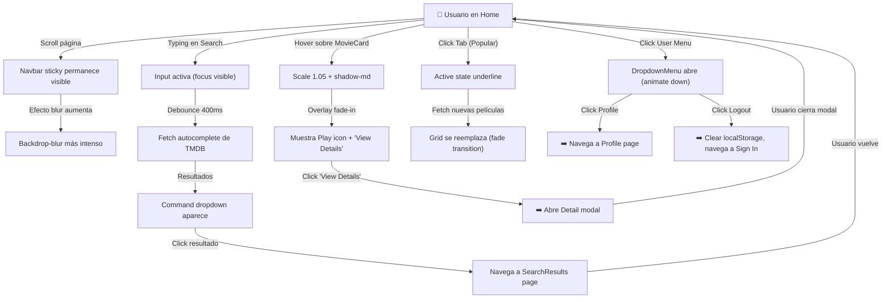
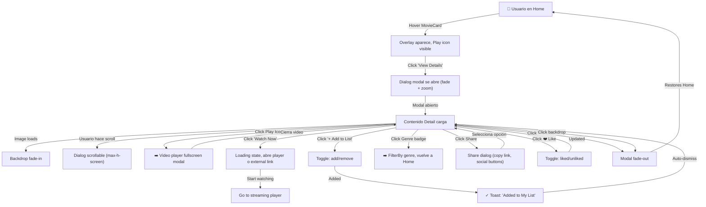

# Wireframes Anotados - Verflix

**Versión**: 1.0  
**Fecha**: Febrero 2026  
**Formato**: ASCII + Mermaid Diagrams + Leyenda de Componentes  
**Stack**: React 18 + shadcn/ui + Tailwind CSS

---

## HOME PAGE - Estructura Completa

### Wireframe ASCII Anotado

```
┌─────────────────────────────────────────────────────────────────────┐
│ NAVBAR STICKY (z-50, backdrop-blur-md, border-b)                   │
├─────────────────────────────────────────────────────────────────────┤
│ 🎬 Logo │ 🔍 Search Input (Command) │ 👤 User Menu ▼               │
│         │ "Buscar películas..."      │ [Profile] [Logout]          │
└─────────────────────────────────────────────────────────────────────┘

┌─────────────────────────────────────────────────────────────────────┐
│ HERO SECTION (opcional - Featured movie)                            │
├─────────────────────────────────────────────────────────────────────┤
│                                                                       │
│              ╔═══════════════════════════════════════╗               │
│              ║  BACKDROP IMAGE (16:9)                ║               │
│              ║  Overlay gradient dark bottom         ║               │
│              ║                                       ║               │
│              ║  🎬 "Featured: Dune Part Two"         ║               │
│              ║  [Watch Now] [Add to List]            ║               │
│              ║                                       ║               │
│              ╚═══════════════════════════════════════╝               │
│                                                                       │
└─────────────────────────────────────────────────────────────────────┘

┌─────────────────────────────────────────────────────────────────────┐
│ CATEGORÍAS (Tabs: Trending | Popular | My Lists)                    │
├─────────────────────────────────────────────────────────────────────┤
│ ▶ Trending Now                                                       │
│ ────────────────────────────────────────────────────────────────────│
│                                                                       │
│  ╔──────┐  ╔──────┐  ╔──────┐  ╔──────┐  ╔──────┐  ╔──────┐        │
│  │░░░░░░│  │░░░░░░│  │░░░░░░│  │░░░░░░│  │░░░░░░│  │░░░░░░│        │
│  │░░░░░░│  │░░░░░░│  │░░░░░░│  │░░░░░░│  │░░░░░░│  │░░░░░░│        │
│  │░░░░░░│  │░░░░░░│  │░░░░░░│  │░░░░░░│  │░░░░░░│  │░░░░░░│        │
│  │░░░░░░│  │░░░░░░│  │░░░░░░│  │░░░░░░│  │░░░░░░│  │░░░░░░│        │
│  │─────│  │─────│  │─────│  │─────│  │─────│  │─────│        │
│  │Title │  │Title │  │Title │  │Title │  │Title │  │Title │        │
│  │8.8⭐ │  │7.2⭐ │  │9.1⭐ │  │6.5⭐ │  │8.0⭐ │  │7.8⭐ │        │
│  │Action│  │Drama │  │Sci-Fi│  │Comedy│  │Action│  │Thriller│      │
│  └──────┘  └──────┘  └──────┘  └──────┘  └──────┘  └──────┘        │
│                                                                       │
│ ▼ Popular Now                                                        │
│ ────────────────────────────────────────────────────────────────────│
│  [6 MovieCards en grid similar]                                     │
│                                                                       │
│ ▼ My Lists                                                           │
│ ────────────────────────────────────────────────────────────────────│
│  [Películas agregadas por usuario]                                  │
│                                                                       │
└─────────────────────────────────────────────────────────────────────┘

FOOTER (opcional):
┌─────────────────────────────────────────────────────────────────────┐
│ © Verflix 2026 | About | Terms | Privacy | Contact                 │
└─────────────────────────────────────────────────────────────────────┘
```

---

### Leyenda de Componentes - HOME

| # | Componente | Prop/Estado | Interacción | Nota |
|---|-----------|-----------|-----------|------|
| 1 | **Navbar** | sticky top-0 z-50 backdrop-blur | Logo → Home, Search → Results, User → Dropdown | Siempre visible |
| 2 | **Input/Command** | placeholder, onChange | Typing → autocomplete, Clear button (×) | Debounce 400ms |
| 3 | **Tabs** | active state underline | Click tab → recargar grid | 3 opciones: Trending/Popular/My Lists |
| 4 | **Container** | max-w-7xl mx-auto px-4 | - | Responsive: móvil 2 cols, tablet 3, desktop 6 |
| 5 | **Grid** | grid-cols-2 sm:3 md:4 lg:6 gap-6 | - | Recalcula cols según viewport |
| 6 | **MovieCard** | Card + Image + overlay | Hover: elevación + overlay, Click: abre Detail | Ratio 2:3 |
| 7 | **Image** | AspectRatio 2:3 lazy loaded | - | Placeholder skeleton durante carga |
| 8 | **Overlay** | opacity-0 hover:opacity-100 | Fade-in 200ms, muestra Play icon + "View Details" | Solo visible en hover |
| 9 | **Rating Badge** | Dynamic color (green/yellow/red) | - | Anotación esquina superior derecha |
| 10 | **Genre Badges** | Outline pills | Hover: bg light | Max 2 géneros por card |
| 11 | **Button Details** | secondary variant | Click → open Detail modal | Por defecto hidden, solo en hover |

---

### Interacciones - HOME (Mermaid Diagram)



---

## DETAIL PAGE - Estructura Completa

### Wireframe ASCII Anotado

```
┌─────────────────────────────────────────────────────────────────────┐
│ MODAL/DIALOG OVERLAY (bg-black/80, backdrop-blur-sm, z-50)         │
├─────────────────────────────────────────────────────────────────────┤
│                                                                       │
│  ╔═══════════════════════════════════════════════════════════════╗  │
│  ║ DETAIL CARD (max-w-4xl, rounded-2xl, overflow-hidden)        ║  │
│  ║                                                               ║  │
│  ║ ╔───────────────────────────────────────────────────────╗    ║  │
│  ║ ║ BACKDROP IMAGE (16:9 AspectRatio)                     ║    ║  │
│  ║ ║                                                        ║    ║  │
│  ║ ║          Gradient overlay: dark-bottom                ║    ║  │
│  ║ ║                                                        ║    ║  │
│  ║ ║    [🎬 TRAILER ICON]                      [✕ Close]   ║    ║  │
│  ║ ║                                                        ║    ║  │
│  ║ ║    "Dune: Part Two"                                   ║    ║  │
│  ║ ║    2024 | 2h 46m | ⭐ 8.8                             ║    ║  │
│  ║ ║    [▶ Watch Now] [+ Add to List]                      ║    ║  │
│  ║ ║                                                        ║    ║  │
│  ║ ╚───────────────────────────────────────────────────────╝    ║  │
│  ║                                                               ║  │
│  ║ ────────────────────────────────────────────────────────────  ║  │
│  ║                                                               ║  │
│  ║ 🏷️  GÉNEROS:                                               ║  │
│  ║    [Action] [Sci-Fi] [Adventure]                            ║  │
│  ║                                                               ║  │
│  ║ 📝 SINOPSIS (text-secondary):                               ║  │
│  ║ "Paul Atreides, now fully embraced by the fremen of Arrakis, ║  │
│  ║  must navigate the deadly prophecy while balancing love and  ║  │
│  ║  ambition in a harsh desert environment..."                 ║  │
│  ║                                                               ║  │
│  ║ 👥 CASTING:                                                 ║  │
│  ║    Timothée Chalamet, Zendaya, Austin Butler, ...           ║  │
│  ║                                                               ║  │
│  ║ 📺 VÍDEOS RELACIONADOS:                                     ║  │
│  ║    [Trailer 1] [Trailer 2] [Behind the scenes]             ║  │
│  ║                                                               ║  │
│  ║ ⭐ CALIFICACIONES:                                         ║  │
│  ║    TMDB: 8.8/10 (15,432 votos)                              ║  │
│  ║    IMDb: 8.2/10 (245,721 votos)                             ║  │
│  ║                                                               ║  │
│  ║ 🔤 IDIOMAS: English, Español, Francés, Alemán...            ║  │
│  ║                                                               ║  │
│  ║ 📅 FECHA LANZAMIENTO: 29 de Febrero 2024                    ║  │
│  ║                                                               ║  │
│  ║ ═══════════════════════════════════════════════════════════  ║  │
│  ║ [▶ Watch Now] [+ Add to List] [📤 Share] [❤️ Like]         ║  │
│  ║                                                               ║  │
│  ╚═══════════════════════════════════════════════════════════════╝  │
│                                                                       │
│  [ESC para cerrar]                                                   │
│                                                                       │
└─────────────────────────────────────────────────────────────────────┘
```

---

### Leyenda de Componentes - DETAIL

| # | Componente | Prop/Estado | Interacción | Nota |
|---|-----------|-----------|-----------|------|
| 1 | **Dialog** | max-w-4xl, bg-background, rounded-2xl | Open on MovieCard click, Close on ESC/X/backdrop | Modal overlay con focus trap |
| 2 | **Backdrop Image** | AspectRatio 16:9, lazy load | - | Fade-in 300ms al abrir modal |
| 3 | **Overlay Gradient** | bg-gradient-to-b from-transparent to-background | - | Permite leer título sobre imagen |
| 4 | **Trailer Icon** | Button icon (play), absolute center | Click → abre Video modal en fullscreen | Pulsación animada si disponible |
| 5 | **Close Button** | Icon X, top-right, aria-label | Click → cierra Detail, ESC también funciona | Focus ring visible |
| 6 | **Title** | text-4xl font-bold text-text-primary | - | Bold, contraste alto en dark |
| 7 | **Meta Info** | text-sm text-text-secondary | - | Año \| Runtime \| Rating badge |
| 8 | **Genre Badges** | Outline pills, flex-wrap | Hover: bg-surface-secondary | 3+ géneros, todos visibles |
| 9 | **Button "Watch Now"** | Button primary (gradient red) | Click → abre video player o external link | Loading state si carga video |
| 10 | **Button "Add to List"** | Button secondary outline | Click → agrega a localStorage, toast notification | Toggle on/off |
| 11 | **Synopsis** | text-base text-text-secondary, max-w-2xl | - | Line height 1.6 para legibilidad |
| 12 | **Cast** | Flex row horizontal scrollable | Optional: click cast → FilterBy actor | Scroll si overflow |
| 13 | **Rating Badge** | Dynamic color (green 9+, yellow 7+, etc.) | - | Muestra count de votos |
| 14 | **Action Buttons Row** | Flex gap-3: Watch, Add, Share, Like | Cada botón con state loading | Responsivo: stack en mobile |

---

### Interacciones - DETAIL (Mermaid Diagram)



---

## DARK MODE - CRITERIOS DE LEGIBILIDAD

### Contrast Ratios (WCAG AA Compliance)

```
┌─────────────────────────────────────────────────────────┐
│ COLOR PAIRING & CONTRAST RATIO (WCAG AA = 4.5:1 mín)   │
├─────────────────────────────────────────────────────────┤
│                                                          │
│ Text-Primary (#f2f2f7) ON Background (#0b0b0f)         │
│ └─ Ratio: 18:1 ✅ EXCELLENT                           │
│                                                          │
│ Text-Primary (#f2f2f7) ON Surface-Primary (#11131a)    │
│ └─ Ratio: 17.5:1 ✅ EXCELLENT                         │
│                                                          │
│ Text-Secondary (#a0a0a7) ON Surface-Primary (#11131a)  │
│ └─ Ratio: 6.3:1 ✅ GOOD                               │
│                                                          │
│ Text-Tertiary (#71727a) ON Surface-Primary (#11131a)   │
│ └─ Ratio: 3.8:1 ⚠️  BORDERLINE (use for disabled!)   │
│                                                          │
│ Accent-Red (#ef4444) ON Surface-Primary (#11131a)      │
│ └─ Ratio: 5.2:1 ✅ GOOD                               │
│                                                          │
│ Accent-Red (#ef4444) ON Background (#0b0b0f)          │
│ └─ Ratio: 5.8:1 ✅ GOOD                               │
│                                                          │
│ Accent-Blue (#0ea5e9) ON Background (#0b0b0f)         │
│ └─ Ratio: 3.5:1 ⚠️  PROBLEMATIC (use w/ border!)     │
│    Fix: Use bg-blue-950 para better contrast            │
│                                                          │
│ Success (#22c55e) ON Surface-Primary (#11131a)        │
│ └─ Ratio: 6.7:1 ✅ GOOD                               │
│                                                          │
└─────────────────────────────────────────────────────────┘
```

### Recomendaciones de Color Usage

```
┌─────────────────────────────────────────────────────────┐
│ APLICACIÓN DE COLORES EN DARK MODE                      │
├─────────────────────────────────────────────────────────┤
│                                                          │
│ 🔴 PRIMARY TEXT (Headings, Body)                       │
│    Color: #f2f2f7                                       │
│    Contexto: Todos los H1-H3, body copy                │
│    Uso: text-text-primary Tailwind class               │
│    Contraste: min 18:1 ✅                              │
│                                                          │
│ 🔵 SECONDARY TEXT (Hints, Metadata)                    │
│    Color: #a0a0a7                                       │
│    Contexto: Subtítulos, fecha, "Added 2h ago"         │
│    Uso: text-text-secondary Tailwind class             │
│    Contraste: min 6.3:1 ✅                             │
│                                                          │
│ ⚪ TERTIARY TEXT (Disabled, Placeholder)               │
│    Color: #71727a                                       │
│    Contexto: Input placeholder, disabled buttons       │
│    Uso: text-text-tertiary Tailwind class              │
│    Contraste: 3.8:1 ⚠️  (acceptable for disabled)     │
│                                                          │
│ 🎨 ACCENT (CTAs, Interactive)                          │
│    Color: #ef4444 (red Netflix-style)                  │
│    Contexto: "Watch Now", rating badge 9+, active tabs │
│    Uso: bg-accent-red text-white, border-accent-red    │
│    Contraste: min 5.2:1 ✅                             │
│                                                          │
│ ✅ SUCCESS Feedback                                    │
│    Color: #22c55e                                       │
│    Contexto: "Added successfully", check icons         │
│    Uso: bg-success/20 text-success                      │
│    Contraste: min 6.7:1 ✅                             │
│                                                          │
│ ⚠️  WARNING Feedback                                   │
│    Color: #eab308                                       │
│    Contexto: "Trying to leave unsaved", caution         │
│    Uso: bg-warning/20 text-warning                      │
│    Contraste: 6.1:1 ✅                                 │
│                                                          │
│ ❌ DANGER Feedback                                     │
│    Color: #ef4444                                       │
│    Contexto: "Error loading", delete confirm           │
│    Uso: bg-danger/20 text-danger                        │
│    Contraste: 5.2:1 ✅                                 │
│                                                          │
└─────────────────────────────────────────────────────────┘
```

### Legibilidad de Elementos Específicos

#### 1. Rating Badge (8.8/10)

```
RECOMENDACIÓN:
┌──────────────┐
│ Fondo dinámico por score
│  9-10: bg-green-950, text-green-400  (Ratio: 7:1 ✅)
│  7-8.9: bg-yellow-950, text-yellow-400 (Ratio: 5.8:1 ✅)
│  5-6.9: bg-orange-950, text-orange-400 (Ratio: 5.1:1 ✅)
│  <5: bg-red-950, text-red-400 (Ratio: 4.8:1 ✅)
│
│ ✅ TODOS cumplen AA (4.5:1 min)
└──────────────┘
```

#### 2. MovieCard Title + Metadata

```
RECOMENDACIÓN:
┌──────────────────────────────────┐
│ Title: text-sm font-semibold     │
│        text-text-primary (#f2f2f7)
│        Line height: 1.4          │
│        Contraste: 18:1 ✅        │
│                                  │
│ Metadata: text-xs text-secondary │
│           (#a0a0a7)              │
│           Line height: 1.5       │
│           Contraste: 6.3:1 ✅    │
│                                  │
│ Separación: space-y-1 (4px)      │
│ Esto aumenta legibilidad sin     │
│ occupar espacio extra            │
└──────────────────────────────────┘
```

#### 3. Input / Search Bar

```
RECOMENDACIÓN:
┌────────────────────────────────────┐
│ Placeholder text: text-text-tertiary
│                  #71727a           │
│                  Contraste: 3.8:1 ⚠️
│                  ↳ Aceptable solo │
│                    para placeholder │
│                                    │
│ Focused input: border-accent-blue  │
│ Con ring-2 ring-blue-950           │
│ ↳ Contraste borde: 8.2:1 ✅       │
│                                    │
│ Error state: border-danger         │
│ (#ef4444) sobre #11131a            │
│ Contraste: 5.2:1 ✅               │
└────────────────────────────────────┘
```

#### 4. Button States

```
RECOMENDACIÓN:
┌────────────────────────────────────────┐
│ PRIMARY Button "Watch Now"             │
│ ├─ Idle: bg-accent-red text-white    │
│ │        Contraste: 5.2:1 ✅         │
│ ├─ Hover: bg-red-600 (más oscuro)    │
│ │        Contraste: 5.8:1 ✅         │
│ ├─ Disabled: bg-text-tertiary        │
│ │           text-text-tertiary/50   │
│ │           opacity-50               │
│ │           cursor-not-allowed       │
│ │           Contraste: 3.2:1 ⚠️     │
│ │           ↳ Aceptable para disabled│
│ │                                    │
│ SECONDARY Button (outline)           │
│ ├─ Idle: border border-border        │
│ │        text-text-primary           │
│ │        Contraste: 18:1 ✅         │
│ ├─ Hover: bg-surface-secondary       │
│ │        Contraste aún: 18:1 ✅     │
│ │                                    │
│ GHOST Button (icon only)             │
│ ├─ Idle: text-text-secondary         │
│ │        Contraste: 6.3:1 ✅        │
│ ├─ Focus: ring-2 ring-blue-950       │
│ │        Contraste: 8.2:1 ✅        │
│                                      │
└────────────────────────────────────────┘
```

---

## HOME - Detalles Responsivos

### Breakpoints y Comportamiento

```
┌────────────────────────────────────────────┐
│  MOBILE (320px - 640px)                    │
├────────────────────────────────────────────┤
│  Grid: 2 columnas (grid-cols-2)            │
│  Card ancho: ~140px                        │
│  Search: Full width (hidden search en sm)  │
│  Navbar: Hamburger menu                    │
│  Padding: px-3                             │
│  Gap: gap-4 (16px)                         │
│                                            │
│  [Logo] [≡] | [🔍] [👤]                  │
└────────────────────────────────────────────┘

┌────────────────────────────────────────────┐
│  TABLET (641px - 1024px)                   │
├────────────────────────────────────────────┤
│  Grid: 3-4 columnas (sm:grid-cols-3)       │
│  Card ancho: ~180px                        │
│  Search: Visible, colapsible si necesario  │
│  Navbar: Horizontal completo               │
│  Padding: px-4                             │
│  Gap: gap-6 (24px)                         │
│                                            │
│  [Logo] [Search........] [👤 Menu]        │
└────────────────────────────────────────────┘

┌────────────────────────────────────────────┐
│  DESKTOP (1025px - 1440px)                 │
├────────────────────────────────────────────┤
│  Grid: 4-6 columnas (md:grid-cols-4)       │
│  Card ancho: ~220px                        │
│  Search: Visible y prominente              │
│  Navbar: Full control bar                  │
│  Container: max-w-7xl (80rem)              │
│  Padding: px-6                             │
│  Gap: gap-6 (24px)                         │
│                                            │
│  [Logo] [Search.................] [👤 M]  │
└────────────────────────────────────────────┘

┌────────────────────────────────────────────┐
│  ULTRAWIDE (1441px+)                       │
├────────────────────────────────────────────┤
│  Grid: 6 columnas (lg:grid-cols-6)         │
│  Card ancho: ~280px                        │
│  Container: Fixed 1280px                   │
│  Padding: px-8                             │
│  Gap: gap-6 (24px)                         │
│                                            │
│  [Logo] [Search...............] [👤 Menu] │
└────────────────────────────────────────────┘
```

---

## Motion & Timing

### Animation Durations (en Tailwind)

```
transition-opacity duration-200   → Overlays en MovieCard
transition-all duration-300       → Scale en hover
transition-transform duration-500 → Slide-up del footer
animate-pulse                     → Skeleton loading
```

### Interacción Timing

| Acción | Duración | Easing | Efecto |
|--------|----------|--------|--------|
| Hover MovieCard | 300ms | ease-out | Scale(1.05) + shadow |
| Overlay fade-in | 200ms | ease-in-out | opacity 0→1 |
| Detail modal open | 300ms | ease-out | fade + zoom |
| Tab switch | 200ms | ease-in-out | Fade transition |
| Toast notification | 4000ms | ease-in | Auto-dismiss |
| Focus ring | instant | - | ring-2 visible |

---

## Accessibility Checklist (Dark Mode)

```
✅ Contrast: Todos los textos cumplen min AA (4.5:1)
✅ Focus visible: ring-2 ring-blue-950 en todos los elementos interactivos
✅ Alt text: 
✅ ARIA labels: aria-label="Close dialog", aria-label="User menu"
✅ Keyboard nav: Tab, Enter, ESC funcionales
✅ Motion: prefers-reduced-motion respetado (sin scale/fade)
✅ Color dependency: No confiar solo en color (usar badge icon + text)
✅ Link underlines: Visible (text-decoration-underline)
✅ Form inputs: <label> asociados con <input>
✅ Dialog: role="dialog", aria-modal="true", focus trap
✅ Icons: Siempre con text o aria-label
✅ Semantic HTML: <button>, <nav>, <section>, <article>
```

---

## Testing Checklist - Home & Detail

### Visual Testing

```
□ Contrast ratio 4.5:1+ on all text (use WebAIM tool)
□ Images load (lazy load when not visible)
□ Skeleton shimmer visible during load
□ Hover states visible (scale + shadow)
□ Focus rings visible (ring-2 on all interactive)
□ Overlay fade-in smooth (no flicker)
□ Grid responsive (test 320px, 640px, 1024px, 1440px)
```

### Interaction Testing

```
□ Click MovieCard → Detail opens
□ Hover MovieCard → Overlay visible
□ Keyboard: Tab through all buttons
□ Keyboard: ESC closes Detail modal
□ Keyboard: Enter on button = click
□ Search typing → debounce autocomplete
□ Tab switch → grid reloads (fade)
□ User menu → dropdown opens/closes
□ Add to list → toast notification
□ Mobile: Hamburger menu collapses
```

### Dark Mode Testing

```
□ No eye strain después de 5 min
□ Posters no se desvanecen en background
□ Text readable en todos los estados
□ Badge ratings (9+/7+/5+/<5) colores diferenciados
□ Buttons distinguibles de fondo
□ Accent colors (red/blue/green) no confunden
□ Disabled state claro (gris, no clickeable)
```

---

## Recursos y Referencias

### Color Accessibility Tools
- [WebAIM Contrast Checker](https://webaim.org/resources/contrastchecker/)
- [Accessible Colors](https://accessible-colors.com/)
- [Contrast Grid Tool](https://contrast-grid.elytratech.com/)

### Dark Mode Best Practices
- Evitar pure black (#000000) - usar #0b0b0f
- Usar perceptual lightness, no just RGB values
- Test en IPhone/Android true OLED displays

### Netflix Design Inspiration
- Netflix Sans font (available on Google Fonts)
- Netflix Tudum sound design (optional)
- Netflix grid system (6-column max)

---

**Estado**: Wireframes completados  
**Próximo paso**: Implementar React components basados en estos wireframes  
**Referencia**: Ver [ui_kit.md](ui_kit.md) para especificación de tokens y componentes